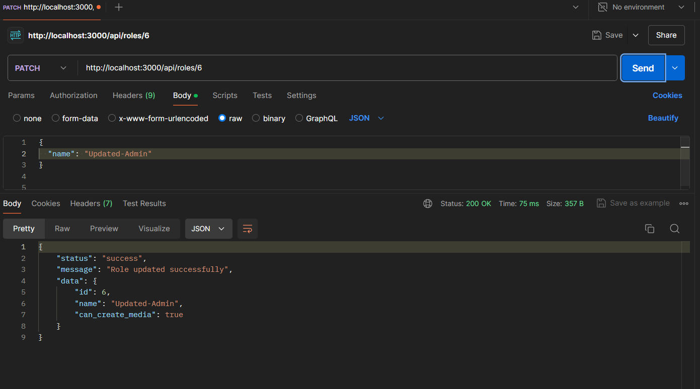
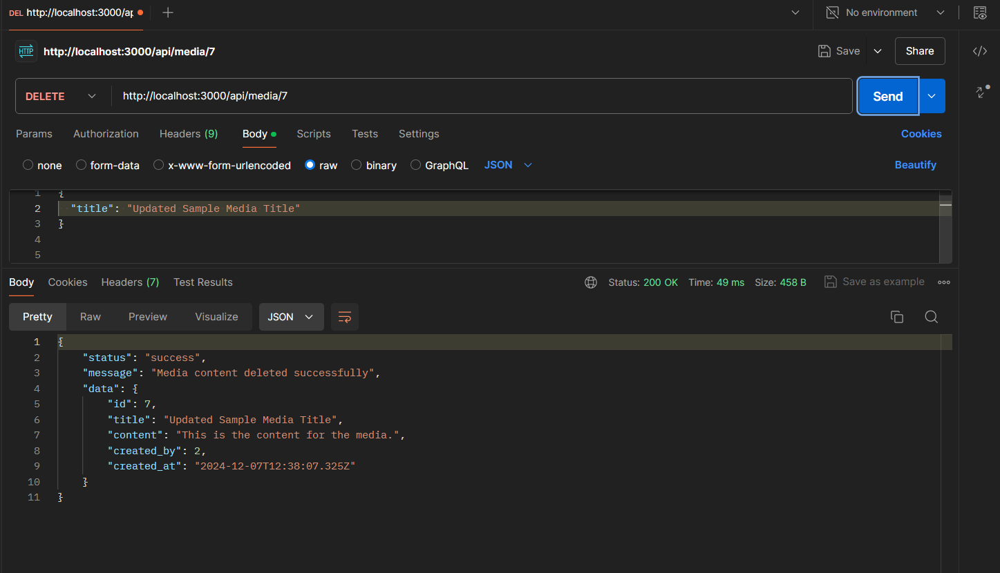

# Тестування працездатності системи

Тестування програми у Postman:

## User

## POST api/user

## GET api/user

## GET api/user/:id

## PATCH api/user/:id

## DELETE api/user/:id

## Roles

## POST api/roles

## GET api/roles

## GET api/roles/:id

## PATCH api/roles/:id

## DELETE api/roles/:id

## MediaContent

## POST api/content

## GET api/content

## GET api/content/:id

## PATCH api/content/:id

## DELETE api/content/:id

---

## EXCEPTION(User): DataMissingException

## EXCEPTION(User): AlreadyRegisteredException

## EXCEPTION(User): UserNotFoundException

## EXCEPTION(MediaContent): RequiredFieldsMissingException

## EXCEPTION(MediaContent): MediaContentNotFoundException

